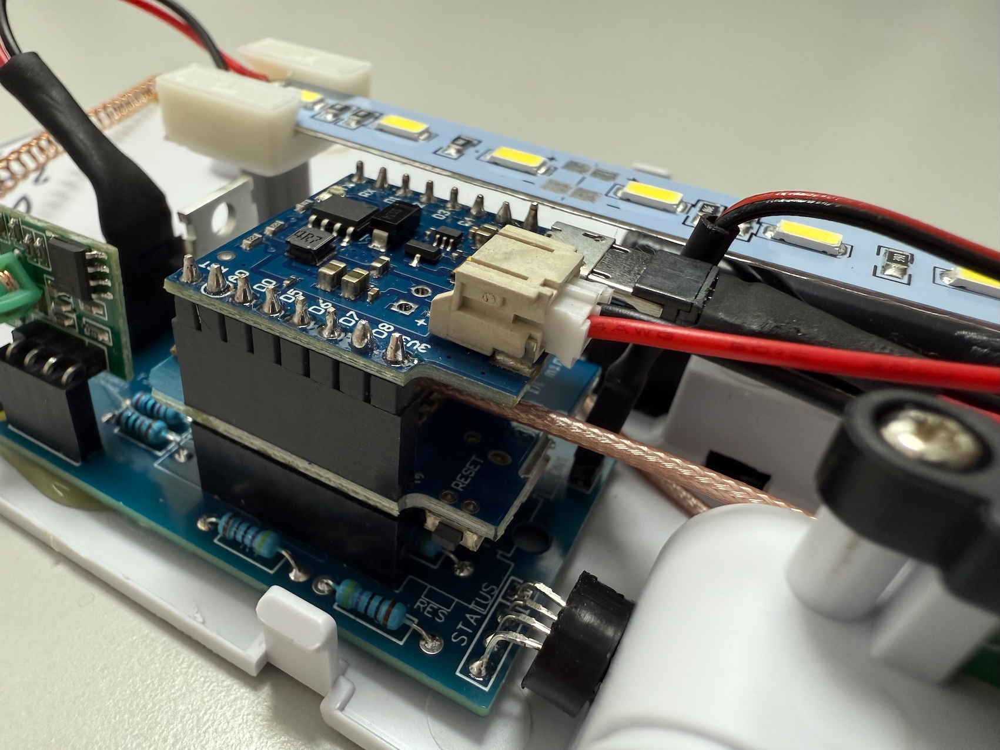

# OnAir Light

Informs those around you about active transmission and prevents accidental "disturbance" or other unpleasant situations by third parties while you are conducting a meeting. Clients for different platforms can use the light to automatic signal their state. A Windows notifier is available - when a session starts, the light will be switched on and of automatically by this module.

For this reason this software supports standard OnAir Lights by extending them with the following features:
- Automatic detection of active cameras.
- Automatic detection of active microphones.
- Multi-client support.
- Multiple luminaires in a network, with their own states, or interconnecting multiple luminaires into one system.
- Integration into smart home automation solutions.
- Provide REST APIs (Public and Authenticated)
- MQTT client implementation with authentication against the server. Is supporting heartbeats and last will mechanism.
- Support for commercially available radio remote controls.
- OTA (Over The Air) update.
- Authentication protection of the admin settings.
- Detecting new published software, with direct download.
- Backup / Restore of configuration settings.
- Reboot and Factory Reset functions.

## How it works

When a client connects to the "On Air Light," it is registered by name, and the status of the microphone and camera is recorded. If there is an open microphone or an active camera on the client, the "On Air" light is activated - flashing the display. If all communication channels are reported as "off," the indicator goes out again. The devices can register via a message broker (MQTT), via the REST API, or via the RF433 interface. Additionally, the button on the housing is also recognized as a "device" that can select a state.
The behavior of the light and its integration into the Wi-Fi or message broker can be configured via a web interface. To avoid name conflicts, each light should be given its own name.
The registered devices can be viewed in the light's administration interface. If a device is inactive for a long time without reporting a status update, it is set to "inactive" and no longer considered.

## Initial Setup
When the device is switched on for the first time, a access point is opened with the name "OnAir-<xxxxxx>" (where xxxxxx corresponds to the universal device ID and is unique for each light). The status light flashes blue. The administration interface can be opened at http://192.168.4.1 The initial password is "admin" and should be changed there.
In the administration interface, you can configure the access data for your own Wi-Fi. When saving, the device restarts, and if the access data is correct, the device connects to your home Wi-Fi network and the status led flashes green.

If the status led is flashing blue again, either you entered a wrong WiFi password, or you selected "fallback" and the WiFi is currently not reachable.

# What is inside

The hardware of this project is based on a Wemos D1 mini (ESP8266) with additional components
- Li-Ion Battery charger / USV
- Li-Ion Battery itself
- RF433 Radio module to receive remote controls.
- Power amplifier to support LED stripes up to 50W.
- LED stripe(s)
- Enhanced WLAN antenna, replaces the Wemos D1 on board
- Enhanced RF433 antenna.
- Additional button to toggle the light or to restart / reset to default settings.

## Build the program
The program is per default designed for the Wemos D1 mini in debug mode and is using currently supported runtimes. The debug version writes a lot of information at the serial port and you can configure what should be reported by the -D compiler flags.
You can identify the debug version in the GUI by the attched "-D" in the release string.

If you want to build the "release" version, you have to select it explicit in the PlatformIO GUI. Be aware, the build counter will increase the build number.

The firmware is stored in the "bin" folder (debug and release) and you can upload it to the module via the OTA feature.

## More...

- [How to assembly](doc/howto-assembly.md)

----
You found errors? 

Let us know so we can check and correct. 