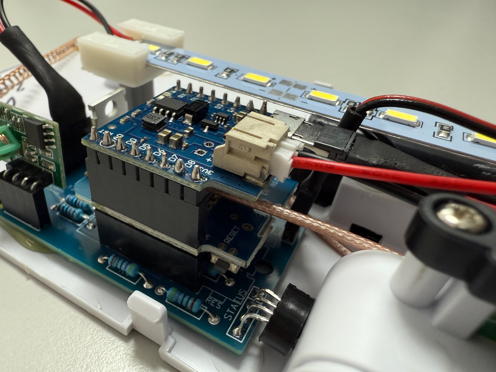

# OnAir Light

The light informs those around you about active audio and video transmission and prevents accidental "disturbance" or other unpleasant situations by third parties while you are conducting a meeting. Clients for different platforms can use the light to automatic signal their state. A Windows notifier is available - when a session starts, the light will be switched on and of automatically by this module.

For this reason this software supports standard OnAir Lights by extending them with the following features:
- Automatic detection of active cameras.
- Automatic detection of active microphones.
- Multi-client support.
- Multiple luminaires in a network, with their own states, or interconnecting multiple luminaires into one system.
- Integration into smart home automation solutions.
- Provide REST APIs (Public and Authenticated)
- MQTT client implementation with authentication against the server. Is supporting heartbeats and last will mechanism.
- Support for commercially available radio remote controls.
- OTA (Over The Air) update.
- Authentication protection of the admin settings.
- Detecting new published software, with direct download.
- Backup / Restore of configuration settings.
- Reboot and Factory Reset functions.

## What is "inside"

Based on a Wemos D1 mini, additional hardware is in place:
- Li-Ion Battery charger / USV
- Li-Ion Battery itself
- RF433 Radio module to receive remote controls.
- Power amplifier to support LED stripes up to 50W.
- LED stripe(s)
- Enhanced WLAN antenna, replaces the Wemos D1 on board
- Enhanced RF433 antenna.
- Additional button to toggle the light or to restart / reset to default settings.

## Target board
The program is designed to use the D1 mini as it is cheap and simple and is using the PLibESPV1 runtime environment.

## Used runtime
If you want to know how to use the runtime and to modifiy enhance the project, you can find the description in  [the Wiki of runtime](https://github.com/LSC-Labs/PLibESPV1/wiki).

