# How to assembly
## Carrier Board
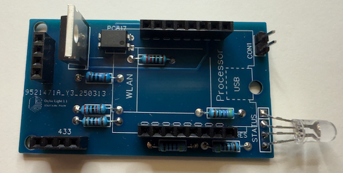

The carrier board hosts the necessary compontens. You can build it by using a standard PCB board by yourself. If you are interrested in the finished layout board, let use know - we can offer you at our own cost. (Same to the used components like the status LED or the opto coupler).

Insert the components from lower to high - start with the resistors. Insert also the status LED, but check before where you want to place the LED - it should be viewable by the user.

## The cpu
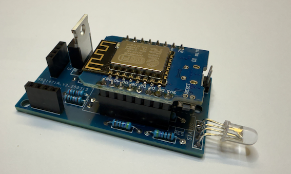

The cpu uses the "plugin" slots of the carrier board. If you plan not to use the battery feature, this is the last layer. Otherwise you have to use the long version of the pins so you can insert the battery pack afterwards.

## WiFi antenna
If you plan to use a battery shield, the build in WiFi antenna will be partial hidden. To avoid this, you can use the D1 mini pro version, which has a pigtail - external antenna. Our decision was not to spoil the device with an external (fix) antenna.
 We build our own internal antenna which can also be used as external if needed but principle it is hidden.

To build the internal antenne, you have to interrput the connection of the build in antenna and attach a coax wire.
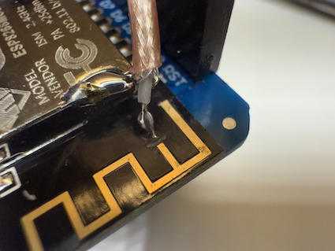

Use a 50 Ohm coax cable (RG178). The antenna shield has to be stripped in length of 3.1 cm.

 At the end it should look like:

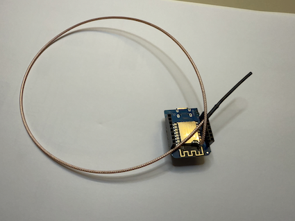

## Battery/Akku support

If you plan to use battery/akku support, you have to insert Li-Ion battery packages - either use a battery package inside, or use a battery slot, by replacing the batteries of the original device.

Install the Mini D1 Battery Shield (at least V1.2) on top of the cpu

The shield supports loading a Li-Ion battery and has a built in "UPS". The akku should have at least 2 to 3 Ah to enable the device to operate in battery mode at least a working day. Be carefully with the polarity of the akkus if you are using an "external" slot with replaceable 16550 batteries.

## RF433 Remote control

Assemble the slot of the carrier plane with the RF433 module. Default is a cheap receiver which you can plug in per default.
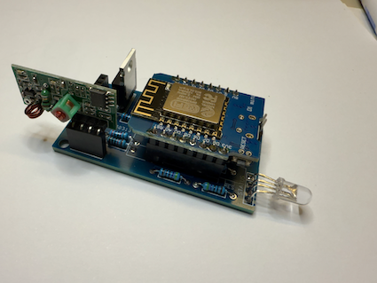

This receiver is usable on short distances but should be enhanced with an own antenna, as it is near the WiFi module, the cpu and the PWM of the OnAir light control. Best is to use the 433 Mhz antenna which could be streched to get better results.
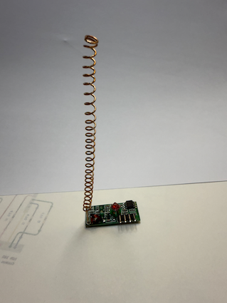

If you are still not satisfied with the receiver, cause you plan to install the OnAir light outside your office, you can replace the receiver with a more powerful version like the RXB8. As this chip has another pin layout you have to use jumper cables, but in principle they are compatible and will be detected without modification in the software.

## LED Stripe(s)

If you have a **good colleague** with a 3D printer, **like Patrick Linke** - you can ask him to print a LED Stripe holder - this will avoid a lot of work to fix the stripes with glue or cable ties ;-)

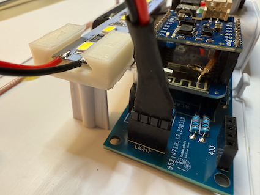

The LED stripe is connected to the LIGHT port of the carrier and should have a reverse polarity protection which is realized by removing one pin and blocking the slot of the pin.

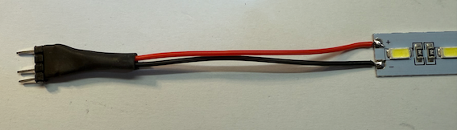

Again - thanks a lot Patrick !

## The case
The case needs
- USB port (power supply)
- Power switch - to disable the akku/powerline
- A sparing for the status LED and 
- A button - best a micro button to avoid bouncing with multiple triggers. The software will try to avoid the bouncing, but if the hardware is already on a good level you can avoid frustration.

## Power supply
Last of all, connect the power lines from the akku, the USB port and the load relay switch. 
The power line (USB) should be connected to the battery shield, not to the cpu.
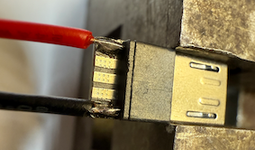
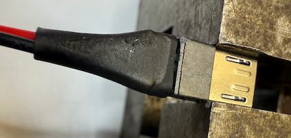
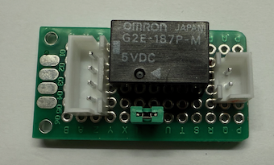
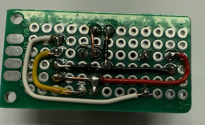

### Attention !
Be carefully not to use multiple usb powerlines by connecting the D1 mini usb and the power supply of the shield at the same time !!!

[<- back](../Readme.md)
